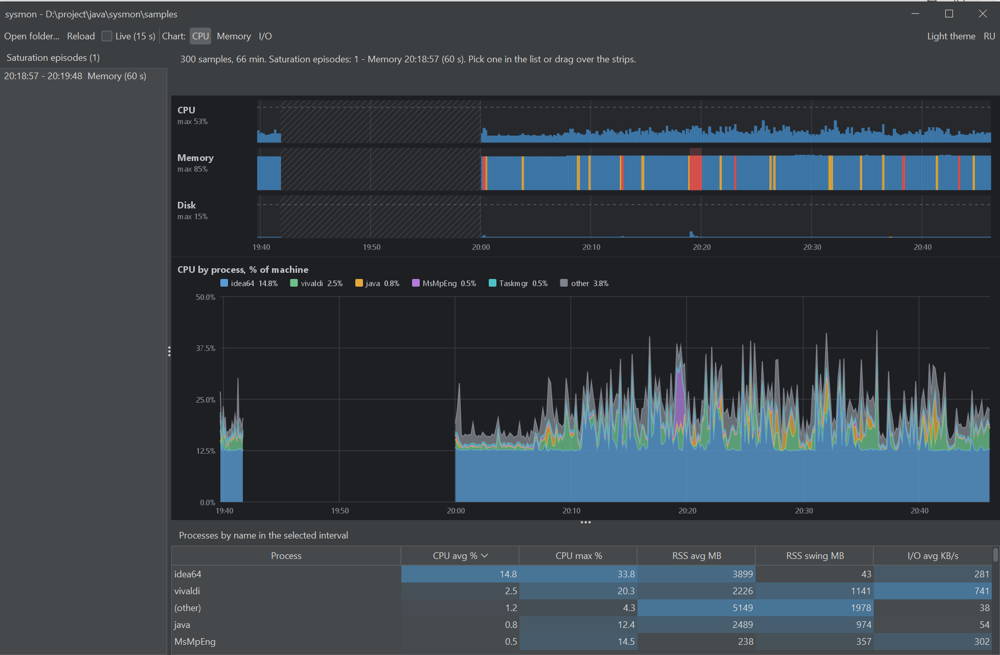

# sysmon

[Русский](README.md)

A portable tool that records what actually loads a computer (CPU, memory, disk, processes) and shows it on clear charts. It runs as a single `jar`: no installation, no administrator rights. It started as an answer to "speed up a work laptop on Windows 11 without admin rights": measure first, then decide what to fix, and bring IT concrete numbers.



## Idea: the USE method

For every resource, look at three things (Brendan Gregg's USE method): **utilization** (how busy it is), **saturation** (whether a queue builds up that the resource cannot serve) and **errors**. 5% CPU load does not mean everything is fine: slowdowns usually come from memory saturation (paging) or disk saturation. So sysmon records not only processes but also system saturation metrics, then finds the intervals where a resource was overloaded and shows who was running at that time.

| Resource | Utilization | Saturation |
|---|---|---|
| CPU | whole-machine load, % | no direct run-queue counter, approximated by load above a threshold |
| Memory | used / total, commit | page-ins per second (paging), low free memory |
| Disk | busy time, MB/s | queue length, busy time above a threshold |

## Quick start

```bash
./gradlew shadowJar                                  # builds build/libs/sysmon.jar
java -jar build/libs/sysmon.jar record --duration=8h # record for 8 hours (Ctrl+C stops earlier)
java -jar build/libs/sysmon.jar report               # console report
java -jar build/libs/sysmon.jar ui                   # charts window
```

By default data is written to and read from the `samples` directory. You can open the window while recording is still running (enable "Live mode").

## Requirements

- To run: Java 21 or newer. To build the jar: Gradle 8.11.1+ (`./gradlew`, JDK 21 as the toolchain).
- Designed for Windows 10/11. The data library (OSHI) is cross-platform, but other systems are untested.
- No administrator rights: sysmon only reads system counters and writes files into its own directory.

## The `record` command

| Option | Default | Meaning |
|---|---|---|
| `--out=samples` | `samples` | directory for `system-*.csv` and `process-*.csv` |
| `--interval=10` | 10 | seconds between samples |
| `--top=25` | 25 | processes written per sample; the rest are folded into one `(other)` row |
| `--max-file-mb=50` | 50 | start a new file at this size |
| `--max-total-mb=500` | 500 | delete the oldest files when the total size exceeds this |
| `--duration=8h` | until Ctrl+C | stop automatically (`s`, `m`, `h`, `d`) |

How it works:

- A baseline snapshot is taken at start and recording begins one interval later. Windows counters are cumulative, so the files hold **rates per interval**, not accumulated values.
- The most significant processes are kept. Significance is the largest of the process's shares of total CPU, memory and I/O, so a process with lots of memory and zero CPU is kept just like a CPU hog. All other processes are summed into `(other)`.
- A second recorder cannot start in the same directory (guarded by a `.recorder.lock` file).
- File names: `system-yyyyMMdd-HHmmss-NNN.csv` and `process-yyyyMMdd-HHmmss-NNN.csv`.
- Process paths and command-line arguments are not recorded, only names.
- Running through `javaw` hides the console, but then recording can only be stopped by `--duration` or by killing the process.

## Data format

Numbers use a dot as the decimal separator regardless of regional settings; time is Unix milliseconds.

`system-*.csv` (one row per sample):

| Column | Meaning |
|---|---|
| `ts_ms` | sample time |
| `cpu_pct` | whole-machine load, 0-100 |
| `logical_cpus` | number of logical processors |
| `mem_total_mb`, `mem_avail_mb` | total and available physical memory |
| `commit_used_mb`, `commit_limit_mb` | committed memory and its limit |
| `pages_in_ps`, `pages_out_ps` | pages read in and written out per second |
| `disk_busy_pct` | disk busy time (maximum over disks), 0-100 |
| `disk_queue` | sum of disk queue lengths |
| `disk_read_kbps`, `disk_write_kbps` | disk read and write, KB/s |

`process-*.csv` (up to `top + 1` rows per sample):

| Column | Meaning |
|---|---|
| `ts_ms` | sample time (same as in `system-*.csv`) |
| `pid` | process id, `-1` for the `(other)` row |
| `name` | process name |
| `procs` | how many processes the row stands for (1, more for `(other)`) |
| `cpu_pct` | CPU load as % of the **whole machine** (0-100) |
| `rss_mb` | working set, MB |
| `io_read_kbps`, `io_write_kbps` | process I/O, KB/s |

Note: `io_*` is all I/O of the process (files, network, devices), not only disk. Use `system-*.csv` for disk load. The `Idle` process (PID 0) is not recorded: its load is the complement to 100% of the machine `cpu_pct`.

## Saturation episodes

An episode is an interval where a resource was overloaded. Criteria:

| Resource | Condition |
|---|---|
| CPU | load above 85% |
| Memory | free memory below 10% **or** page-ins above 500/s **or** commit above 90% of the limit |
| Disk | busy above 80% **or** queue of at least 2 |

Consecutive samples over the threshold form a run, runs closer than 30 seconds are merged, and an episode counts if it lasts at least 30 seconds (last sample minus first plus one interval). Shorter spikes are visible as red bars on the chart but are not episodes.

## The `report` command

```bash
java -jar sysmon.jar report --in=samples --lang=en --top=10 --file=report.txt
```

Prints the recording header, a machine table (average, 95th percentile, maximum), the list of episodes (time and main processes for each) and the top processes by CPU and by memory. The language defaults to the system language (`--lang=ru|en`). `--file` also saves the report as UTF-8, which is handy to attach to an IT request.

Processes are grouped **by name** (all `java` or `vivaldi` are added up). CPU and I/O are averaged over all samples of the window (a process missing from the top list was folded into `(other)`), memory is averaged over the samples where the process is present. "RSS swing" is the difference between the maximum and minimum memory of a process in the window; it helps find whose memory grew.

## The `ui` command

```bash
java -jar sysmon.jar ui --in=samples --lang=en --theme=dark
```

- **Three strips** (CPU, memory, disk) over the whole recording. Bar height is utilization, bar colour is saturation (blue, yellow, red), red background bands are episodes. Gaps in the recording (sleep, restarts) are hatched.
- **Interval selection:** drag across the strips; a click clears the selection. Everything below shows the selected interval.
- **Verdict line** describes the interval in words: peaks, overlapping episodes, main processes by CPU and I/O, the biggest memory change.
- **Episode list** on the left: a click selects the episode interval.
- **Stacked chart** of the top 5 processes (by name) plus "other"; the metric is switchable: CPU, memory, I/O. A tooltip shows the values on hover.
- **Process table** for the interval with heat-map shading and sorting.
- Toolbar: open folder, reload, "Live mode" (re-reads the files every 15 seconds), light and dark theme, RU/EN language.

## Example finding

A recording on a developer laptop: a project build ran at 20:18-20:20. The window showed a 60-second memory episode: page-ins up to 2145/s, disk busy up to 15%, and `MsMpEng` (Microsoft Defender) reading 8-12 MB/s at 6-9% of machine CPU. That is consistent with the antivirus scanning files that the build writes. This is exactly the kind of evidence you can attach to a request for scan exclusions for build directories and caches.

## Limitations

- There is no direct CPU run-queue counter; CPU saturation is approximated by high load.
- Process I/O is not disk I/O (see above). Disk busy time and queue come from Windows counters through OSHI; on a given machine it is worth checking them under load (copy a large file and see whether `disk_busy_pct` and `disk_queue` rise).
- Small processes end up in `(other)`: raise `--top` for a more detailed view.
- `report` and `ui` read the whole directory into memory. That is fine for several days of recording; hundreds of megabytes would need streaming loading.
- "Live mode" rebuilds the window when new data arrives, which resets table sorting.
- The working set (`rss_mb`) includes shared pages, so the sum over processes can exceed the physical memory in use.

## Querying the CSV with SQL (optional)

You can analyse the CSV with any tool that runs SQL over CSV, for example the **CSV Query** Notepad++ plugin (the table is called `this`, the query must be a single line, values are stored as text, so use `CAST`). Example: when paging happened (file `system-*.csv`)

```sql
SELECT ts_ms, cpu_pct, mem_avail_mb, pages_in_ps, disk_busy_pct FROM this WHERE CAST(pages_in_ps AS REAL) > 500 ORDER BY ts_ms
```


**Recording summary.** Shows how heavy the machine was: the number of samples, average and maximum CPU load, minimum free memory, maximum paging and disk busy time. A quick answer to "was there anything serious at all".

```sql
SELECT COUNT(*) AS samples, ROUND(AVG(CAST(cpu_pct AS REAL)),1) AS avg_cpu, ROUND(MAX(CAST(cpu_pct AS REAL)),1) AS max_cpu, ROUND(MIN(CAST(mem_avail_mb AS REAL)),0) AS min_free_mb, ROUND(MAX(CAST(pages_in_ps AS REAL)),0) AS max_pages_in, ROUND(MAX(CAST(disk_busy_pct AS REAL)),1) AS max_disk_busy FROM this
```

**Moments of memory shortage.** Rows where paging is above 500 pages per second (the memory threshold used for episodes). Consecutive rows form one episode, and the time helps you find it in the window or in `process-*.csv`.

```sql
SELECT datetime(CAST(ts_ms AS INTEGER)/1000,'unixepoch','localtime') AS time, ROUND(CAST(pages_in_ps AS REAL),0) AS pages_in, mem_avail_mb, ROUND(CAST(disk_busy_pct AS REAL),1) AS disk_busy, ROUND(CAST(cpu_pct AS REAL),1) AS cpu FROM this WHERE CAST(pages_in_ps AS REAL) > 500 ORDER BY CAST(ts_ms AS INTEGER)
```

**Moments of disk load.** Samples where the disk is busy more than 50% or the queue is at least 1, with read and write speed. It is also a check of the disk counters: if you copy a large file and there is not a single row here, the counter on this machine most likely does not work.

```sql
SELECT datetime(CAST(ts_ms AS INTEGER)/1000,'unixepoch','localtime') AS time, ROUND(CAST(disk_busy_pct AS REAL),1) AS busy, disk_queue, ROUND(CAST(disk_read_kbps AS REAL),0) AS read_kbps, ROUND(CAST(disk_write_kbps AS REAL),0) AS write_kbps FROM this WHERE CAST(disk_busy_pct AS REAL) > 50 OR CAST(disk_queue AS REAL) >= 1 ORDER BY CAST(ts_ms AS INTEGER)
```

Example: average CPU load per process name over the whole recording (file `process-*.csv`)

```sql
SELECT name, ROUND(SUM(CAST(cpu_pct AS REAL)) / (SELECT COUNT(DISTINCT ts_ms) FROM this), 2) AS avg_cpu FROM this GROUP BY name ORDER BY avg_cpu DESC LIMIT 20
```


**Who reads and writes the most.** Average process I/O in KB/s over the whole recording (read plus write). It is divided by the number of all samples, not only those where the process made it into the top list, so rare processes are not inflated. Reminder: this is all I/O of the process, not only disk.

```sql
SELECT name, ROUND(SUM(CAST(io_read_kbps AS REAL) + CAST(io_write_kbps AS REAL)) / (SELECT COUNT(DISTINCT ts_ms) FROM this), 1) AS avg_io_kbps FROM this GROUP BY name ORDER BY avg_io_kbps DESC LIMIT 20
```

**Memory per process name and its growth.** The inner query first adds up the memory of all processes with the same name in every sample (all `vivaldi` tabs, all `java`), the outer one computes the average, maximum and swing (`swing_mb`) across samples. A large swing means the memory of a process grew or dropped noticeably, a hint of who is "inflating".

```sql
SELECT name, ROUND(AVG(mem),0) AS avg_mb, ROUND(MAX(mem),0) AS max_mb, ROUND(MAX(mem)-MIN(mem),0) AS swing_mb FROM (SELECT ts_ms, name, SUM(CAST(rss_mb AS REAL)) AS mem FROM this GROUP BY ts_ms, name) GROUP BY name ORDER BY avg_mb DESC LIMIT 20
```

**Who was running during the chosen minutes.** Substitute the start and end of the interval (local time) taken from the previous queries or from an episode in the window. The result is the average CPU and I/O per process for that period, that is, what the table in the window shows, but in SQL. The time appears twice because the divisor must be counted over all samples of the interval.

```sql
SELECT name, ROUND(SUM(CAST(cpu_pct AS REAL)) / (SELECT COUNT(DISTINCT ts_ms) FROM this WHERE datetime(CAST(ts_ms AS INTEGER)/1000,'unixepoch','localtime') BETWEEN '2026-10-05 20:18:57' AND '2026-10-05 20:19:48'), 2) AS avg_cpu, ROUND(SUM(CAST(io_read_kbps AS REAL) + CAST(io_write_kbps AS REAL)) / (SELECT COUNT(DISTINCT ts_ms) FROM this WHERE datetime(CAST(ts_ms AS INTEGER)/1000,'unixepoch','localtime') BETWEEN '2026-10-05 20:18:57' AND '2026-10-05 20:19:48'), 0) AS avg_io_kbps FROM this WHERE datetime(CAST(ts_ms AS INTEGER)/1000,'unixepoch','localtime') BETWEEN '2026-10-05 20:18:57' AND '2026-10-05 20:19:48' GROUP BY name ORDER BY avg_cpu DESC LIMIT 10
```

## Project layout

```text
sysmon/
├── build.gradle
├── settings.gradle
└── src/
    ├── main/java/ru/mcs/sysmon/
    │   ├── cli/        Main, record, report, ui, argument parsing, language
    │   ├── collector/  Sampler (OSHI), top-N selection
    │   ├── model/      SystemSample, ProcessSample, Sample
    │   ├── storage/    CSV writer with rotation and a disk quota
    │   ├── analysis/   recording loader, saturation episodes, per-name aggregation
    │   └── ui/         Swing + FlatLaf window, Java2D charts
    └── test/
        ├── java/...    tests for rotation, top-N, episodes, report and window
        └── resources/sample/  a real recording used by the tests
```

Tests: `./gradlew test`. The chart components are checked headless (rendered into an image); the look of the window is checked by eye.

## License

sysmon is released under the [MIT License](LICENSE): you may use, modify and distribute it freely as long as the copyright notice is kept.

The jar bundles third-party libraries (OSHI, JNA, FlatLaf, SLF4J API) under their own licenses; they are listed in [THIRD-PARTY-NOTICES.md](THIRD-PARTY-NOTICES.md).