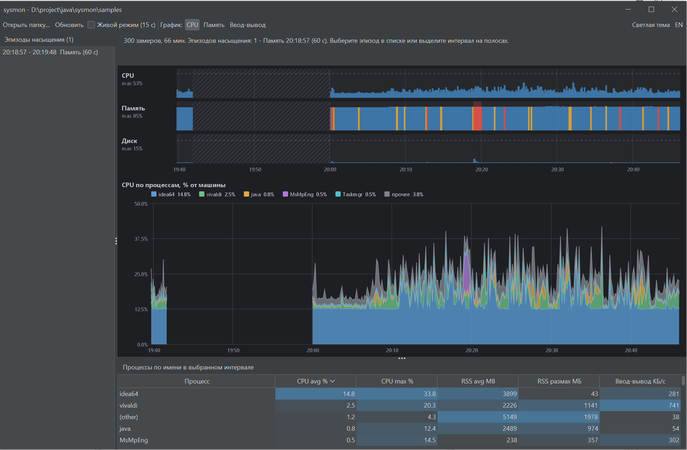
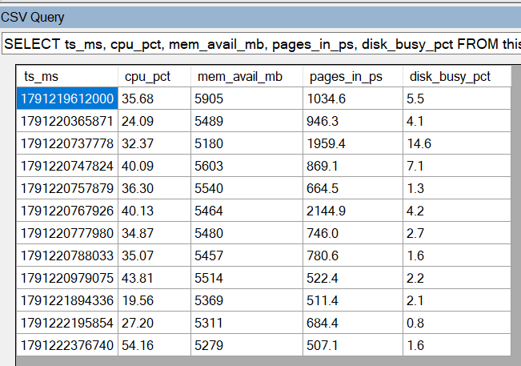
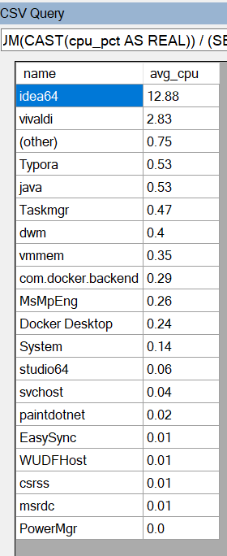

# sysmon

[English](README.en.md)

Portable-утилита, которая записывает, что реально грузит компьютер (CPU, память, диск, процессы), и показывает это на понятных графиках. Запускается одним `jar`-файлом, без установки и без прав администратора. Родилась из задачи «ускорить рабочий ноутбук на Windows 11, не имея админских прав»: сначала измеряем, потом решаем, что чинить, и приносим в IT конкретные цифры.



## Идея: метод USE

Для каждого ресурса смотрим три вещи (метод USE Брендана Грегга): **утилизацию** (насколько занят), **насыщение** (накопилась ли очередь, которую ресурс не успевает обслужить) и **ошибки**. Загрузка CPU в 5% ещё не значит, что всё хорошо: тормоза чаще дают насыщение памяти (подкачка) или диска. Поэтому sysmon пишет не только процессы, но и системные метрики насыщения, а затем автоматически находит интервалы, где ресурс был перегружен, и показывает, кто в это время работал.

| Ресурс | Утилизация | Насыщение |
|---|---|---|
| CPU | загрузка всей машины, % | прямого счётчика очереди нет, приближение: загрузка выше порога |
| Память | занято / всего, commit | page-in в секунду (подкачка), мало свободной памяти |
| Диск | время занятости, МБ/с | длина очереди, занятость выше порога |

## Быстрый старт

```bash
./gradlew shadowJar                                  # собрать build/libs/sysmon.jar
java -jar build/libs/sysmon.jar record --duration=8h # писать 8 часов (Ctrl+C останавливает раньше)
java -jar build/libs/sysmon.jar report               # отчёт в консоли
java -jar build/libs/sysmon.jar ui                   # окно с графиками
```

По умолчанию данные пишутся в каталог `samples` и оттуда же читаются. Окно можно открыть, пока запись ещё идёт (включите «Живой режим»).

## Требования

- Для запуска: Java 21 и выше. Сборка jar: Gradle 8.11.1+ (`./gradlew`, JDK 21 как toolchain).
- Рассчитано на Windows 10/11. Библиотека сбора данных (OSHI) кроссплатформенная, но на других системах утилита не проверялась.
- Права администратора не нужны: sysmon только читает системные счётчики и пишет файлы в свой каталог.

## Команда `record`

| Параметр | По умолчанию | Смысл |
|---|---|---|
| `--out=samples` | `samples` | каталог для `system-*.csv` и `process-*.csv` |
| `--interval=10` | 10 | секунд между замерами |
| `--top=25` | 25 | сколько процессов писать в каждом замере, остальные складываются в строку `(other)` |
| `--max-file-mb=50` | 50 | при таком размере файла начинается новый |
| `--max-total-mb=500` | 500 | при превышении суммарного размера удаляются самые старые файлы |
| `--duration=8h` | до Ctrl+C | автоматическая остановка (`s`, `m`, `h`, `d`) |

Как это работает:

- При старте берётся базовый снимок, а запись начинается через один интервал. Счётчики Windows накопительные, поэтому в файл пишутся **скорости за интервал**, а не накопленные значения.
- Из процессов сохраняются самые значимые: значимость процесса — наибольшая из его долей в общем CPU, памяти и вводе-выводе. Поэтому процесс с большой памятью и нулевым CPU не теряется, как и процесс с большим CPU. Остальные процессы суммируются в `(other)`.
- Второй экземпляр записи в тот же каталог не стартует (защита файлом `.recorder.lock`).
- Имена файлов: `system-yyyyMMdd-HHmmss-NNN.csv` и `process-yyyyMMdd-HHmmss-NNN.csv`.
- Пути процессов и аргументы командной строки не записываются, только имена.
- Запуск через `javaw` скрывает консоль, но останавливать запись тогда можно только по `--duration` или завершив процесс.

## Формат данных

Числа пишутся с точкой (независимо от региональных настроек), время в миллисекундах Unix.

`system-*.csv` (одна строка на замер):

| Колонка | Смысл |
|---|---|
| `ts_ms` | время замера |
| `cpu_pct` | загрузка всей машины, 0–100 |
| `logical_cpus` | число логических процессоров |
| `mem_total_mb`, `mem_avail_mb` | всего и доступно физической памяти |
| `commit_used_mb`, `commit_limit_mb` | использовано и лимит commit-памяти |
| `pages_in_ps`, `pages_out_ps` | страниц подгружено и выгружено в секунду |
| `disk_busy_pct` | занятость диска (максимум по дискам), 0–100 |
| `disk_queue` | сумма длин очередей дисков |
| `disk_read_kbps`, `disk_write_kbps` | чтение и запись диска, КБ/с |

`process-*.csv` (до `top + 1` строк на замер):

| Колонка | Смысл |
|---|---|
| `ts_ms` | время замера (то же, что в `system-*.csv`) |
| `pid` | идентификатор процесса, `-1` у строки `(other)` |
| `name` | имя процесса |
| `procs` | сколько процессов в строке (1, у `(other)` больше) |
| `cpu_pct` | загрузка CPU, % от **всей машины** (0–100) |
| `rss_mb` | рабочий набор памяти, МБ |
| `io_read_kbps`, `io_write_kbps` | ввод-вывод процесса, КБ/с |

Важно: `io_*` — это весь ввод-вывод процесса (файлы, сеть, устройства), а не только диск. Нагрузку на диск смотрите по `system-*.csv`. Процесс `Idle` (PID 0) не записывается: его загрузка — это дополнение до 100% к `cpu_pct` машины.

## Эпизоды насыщения

Эпизод — интервал, где ресурс был перегружен. Критерии:

| Ресурс | Условие |
|---|---|
| CPU | загрузка выше 85% |
| Память | свободно меньше 10% **или** page-in выше 500/с **или** commit выше 90% лимита |
| Диск | занят выше 80% **или** очередь не меньше 2 |

Подряд идущие замеры с превышением образуют серию, серии ближе 30 секунд склеиваются, а эпизод считается, если длится не меньше 30 секунд (последний замер минус первый плюс один интервал). Более короткие всплески видны на графике красными столбцами, но эпизодами не считаются.

## Команда `report`

```bash
java -jar sysmon.jar report --in=samples --lang=ru --top=10 --file=report.txt
```

Печатает в консоль заголовок записи, таблицу по машине (среднее, 95-й процентиль, максимум), список эпизодов (для каждого: время и главные процессы) и топ процессов по CPU и по памяти. Язык по умолчанию определяется по системе (`--lang=ru|en`). `--file` дополнительно сохраняет отчёт в UTF-8, его удобно приложить к заявке в IT.

Процессы группируются **по имени** (все `java` или `vivaldi` складываются). CPU и ввод-вывод усредняются по всем замерам окна (процесса нет в топе, значит, он вошёл в `(other)`), память — по замерам, где процесс присутствует. «Размах RSS» — разница максимума и минимума памяти процесса в окне, она помогает найти, у кого память выросла.

## Команда `ui`

```bash
java -jar sysmon.jar ui --in=samples --lang=ru --theme=dark
```

- **Три полосы** (CPU, память, диск) на всю запись. Высота столбца — утилизация, цвет — насыщение (синий, жёлтый, красный), красные фоновые полосы — эпизоды. Пропуски в записи (сон, остановка) заштрихованы.
- **Выделение интервала:** протяните мышью по полосам, клик снимает выделение. Всё, что ниже, показывает выбранный интервал.
- **Строка вывода** описывает интервал словами: пики, пересекающиеся эпизоды, главные процессы по CPU и вводу-выводу, самое большое изменение памяти.
- **Список эпизодов** слева: клик выделяет интервал эпизода.
- **График** топ-5 процессов (по имени) и «прочее» с накоплением; метрика переключается: CPU, память, ввод-вывод. При наведении всплывает подсказка с значениями.
- **Таблица процессов** за интервал с тепловой подсветкой и сортировкой.
- Панель инструментов: открыть папку, обновить, «Живой режим» (перечитывает файлы каждые 15 секунд), светлая и тёмная тема, язык RU/EN.

## Пример находки

Запись на ноутбуке разработчика: в 20:18–20:20 шла сборка проекта. Окно показало эпизод памяти на 60 секунд: `page-in` до 2145/с, диск занят до 15%, а `MsMpEng` (Microsoft Defender) читал 8–12 МБ/с при 6–9% CPU машины. Это согласуется с проверкой антивирусом файлов, которые пишет сборка. Именно такой аргумент можно приложить к заявке на исключения сканирования для каталогов сборки и кэшей.

## Ограничения

- Прямого счётчика очереди CPU нет, насыщение CPU приближается высокой загрузкой.
- Ввод-вывод процесса не равен диску (см. выше). Занятость и очередь диска берутся из счётчиков Windows через OSHI и на конкретной машине их стоит проверить нагрузкой (скопировать большой файл и посмотреть, выросли ли `disk_busy_pct` и `disk_queue`).
- Мелкие процессы попадают в `(other)`: если нужен более подробный взгляд, увеличьте `--top`.
- `report` и `ui` читают весь каталог в память. Для записи на несколько суток это нормально, для сотен мегабайт понадобится потоковая загрузка.
- «Живой режим» перестраивает окно при появлении новых данных, сортировка таблицы при этом сбрасывается.
- Рабочий набор памяти (`rss_mb`) включает общие страницы, сумма по процессам может превышать занятую физическую память.

## Анализ CSV в SQL (необязательно)

CSV можно разбирать любым инструментом, который умеет SQL по CSV, например плагином **CSV Query** для Notepad++ (таблица называется `this`, запрос пишется в одну строку, значения хранятся как текст, поэтому используйте `CAST`). Пример: когда была подкачка

```sql
SELECT ts_ms, cpu_pct, mem_avail_mb, pages_in_ps, disk_busy_pct FROM this WHERE CAST(pages_in_ps AS REAL) > 500 ORDER BY ts_ms
```



**Сводка по записи.** Показывает, насколько тяжёлой была машина: сколько замеров, средняя и максимальная загрузка CPU, минимум свободной памяти, максимум подкачки и занятости диска. Это быстрый ответ на «было ли вообще что-то серьёзное».

```sql
SELECT COUNT(*) AS samples, ROUND(AVG(CAST(cpu_pct AS REAL)),1) AS avg_cpu, ROUND(MAX(CAST(cpu_pct AS REAL)),1) AS max_cpu, ROUND(MIN(CAST(mem_avail_mb AS REAL)),0) AS min_free_mb, ROUND(MAX(CAST(pages_in_ps AS REAL)),0) AS max_pages_in, ROUND(MAX(CAST(disk_busy_pct AS REAL)),1) AS max_disk_busy FROM this
```

**Моменты нехватки памяти.** Строки, где подкачка выше 500 страниц в секунду (порог памяти из эпизодов). Идущие подряд строки — это один эпизод, а время помогает найти его в окне или в process-*.csv.

```sql
SELECT datetime(CAST(ts_ms AS INTEGER)/1000,'unixepoch','localtime') AS time, ROUND(CAST(pages_in_ps AS REAL),0) AS pages_in, mem_avail_mb, ROUND(CAST(disk_busy_pct AS REAL),1) AS disk_busy, ROUND(CAST(cpu_pct AS REAL),1) AS cpu FROM this WHERE CAST(pages_in_ps AS REAL) > 500 ORDER BY CAST(ts_ms AS INTEGER)
```

**Моменты нагрузки на диск.** Замеры, где диск занят больше чем на 50% или очередь не меньше 1, со скоростью чтения и записи. Это одновременно проверка счётчиков диска: если во время копирования большого файла здесь нет ни одной строки, счётчик на этой машине, скорее всего, не работает.

```sql
SELECT datetime(CAST(ts_ms AS INTEGER)/1000,'unixepoch','localtime') AS time, ROUND(CAST(disk_busy_pct AS REAL),1) AS busy, disk_queue, ROUND(CAST(disk_read_kbps AS REAL),0) AS read_kbps, ROUND(CAST(disk_write_kbps AS REAL),0) AS write_kbps FROM this WHERE CAST(disk_busy_pct AS REAL) > 50 OR CAST(disk_queue AS REAL) >= 1 ORDER BY CAST(ts_ms AS INTEGER)
```


Пример: средняя нагрузка CPU по имени процесса на всей записи (файл `process-*.csv`)

```sql
SELECT name, ROUND(SUM(CAST(cpu_pct AS REAL)) / (SELECT COUNT(DISTINCT ts_ms) FROM this), 2) AS avg_cpu FROM this GROUP BY name ORDER BY avg_cpu DESC LIMIT 20
```



**Кто больше всех читает и пишет.** Средний ввод-вывод процесса в КБ/с по всей записи (прочитанное плюс записанное). Делится на число всех замеров, а не только тех, где процесс попал в топ, поэтому редкие процессы не завышаются. Напоминание: это весь ввод-вывод процесса, а не только диск.

```sql
SELECT name, ROUND(SUM(CAST(io_read_kbps AS REAL) + CAST(io_write_kbps AS REAL)) / (SELECT COUNT(DISTINCT ts_ms) FROM this), 1) AS avg_io_kbps FROM this GROUP BY name ORDER BY avg_io_kbps DESC LIMIT 20
```

**Память по имени процесса и её рост.** Внутренний запрос сначала складывает память всех процессов с одним именем в каждом замере (все вкладки vivaldi, все java), внешний считает среднее, максимум и размах (swing_mb) по замерам. Большой размах означает, что память процесса заметно росла или падала, и это подсказка, кто «раздувается».

```sql
SELECT name, ROUND(AVG(mem),0) AS avg_mb, ROUND(MAX(mem),0) AS max_mb, ROUND(MAX(mem)-MIN(mem),0) AS swing_mb FROM (SELECT ts_ms, name, SUM(CAST(rss_mb AS REAL)) AS mem FROM this GROUP BY ts_ms, name) GROUP BY name ORDER BY avg_mb DESC LIMIT 20
```

**Кто работал в выбранные минуты.** Подставьте начало и конец интервала (местное время) из предыдущих запросов или из эпизода в окне. Результат: средний CPU и ввод-вывод по процессам за этот период, то есть то же, что показывает таблица в окне, но в SQL. Время дважды повторяется, потому что делитель должен считаться по всем замерам окна.

```sql
SELECT name, ROUND(SUM(CAST(cpu_pct AS REAL)) / (SELECT COUNT(DISTINCT ts_ms) FROM this WHERE datetime(CAST(ts_ms AS INTEGER)/1000,'unixepoch','localtime') BETWEEN '2026-10-05 20:18:57' AND '2026-10-05 20:19:48'), 2) AS avg_cpu, ROUND(SUM(CAST(io_read_kbps AS REAL) + CAST(io_write_kbps AS REAL)) / (SELECT COUNT(DISTINCT ts_ms) FROM this WHERE datetime(CAST(ts_ms AS INTEGER)/1000,'unixepoch','localtime') BETWEEN '2026-10-05 20:18:57' AND '2026-10-05 20:19:48'), 0) AS avg_io_kbps FROM this WHERE datetime(CAST(ts_ms AS INTEGER)/1000,'unixepoch','localtime') BETWEEN '2026-10-05 20:18:57' AND '2026-10-05 20:19:48' GROUP BY name ORDER BY avg_cpu DESC LIMIT 10
```

## Структура проекта

```text
sysmon/
├── build.gradle
├── settings.gradle
└── src/
    ├── main/java/ru/mcs/sysmon/
    │   ├── cli/        Main, record, report, ui, разбор аргументов, язык
    │   ├── collector/  Sampler (OSHI), отбор топ-N
    │   ├── model/      SystemSample, ProcessSample, Sample
    │   ├── storage/    запись CSV с ротацией и лимитом места
    │   ├── analysis/   загрузка записи, эпизоды насыщения, агрегация по имени
    │   └── ui/         окно Swing + FlatLaf, графики на Java2D
    └── test/
        ├── java/...    тесты ротации, топ-N, эпизодов, отчёта и окна
        └── resources/sample/  реальная запись для тестов
```

Тесты: `./gradlew test`. Графические компоненты проверяются без экрана (отрисовка в изображение), внешний вид окна проверяется глазами.
